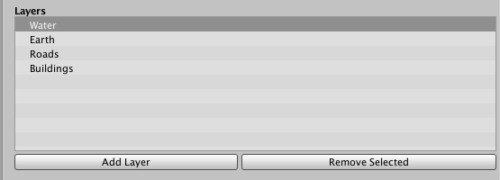
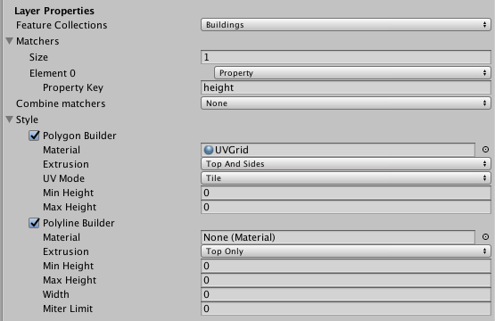

Map Style Editor
================

You can edit and save the settings for your map in an asset called a Map Style. To create a new Map Style, go to the 'Assets' menu and choose 'Create' -> 'Mapzen' -> 'MapStyle'. To edit the Map Style, select it from the project window and then use the inspector window to view and change settings.

Editing Options
---------------

If you enable the option to update while editing, any RegionMap instances in the current scene that use this MapStyle will be rebuilt using the current MapStyle settings whenever a change is made. **IMPORTANT:** These automatic updates will overwrite any manual edits you have made to the map objects in the scene.

Layer List
----------

Next is a list of "Layers". Each Layer in a Map Style represents a grouping of objects in the map data (these objects are called features) and the settings that will be applied to those objects when they are downloaded.

You can add a new layer with the 'Add Layer' button and remove one or more layers by selecting them in the list and pressing the 'Remove Selected' button. The ordering of Layers in the list does not affect the construction of the map.

Layers can be renamed in the list by selecting one and pressing Enter. It's often helpful to name Layers according to the grouping of features that you intend to include in the Layer. For example, if you wanted a Layer to style buildings of a certain height you could name the layer "Tall Buildings".

Layer Properties
----------------

When a layer is selected its properties will be displayed below the list.

### Feature Collections

Features in the map data are organized into broad groupings called "feature collections". Use this drop-down to select which feature collection(s) this Layer will apply to.

### Matchers

To narrow down the set of features that this Layer will apply to, you can add one or more Matchers in the form of a list.

Each item in the list is a separate Matcher, which can be one of several types selectable from the drop-down.

Type | Description
-----|------------
None | Matches all features.
Property | Matches features that contain the property named in 'Property Key', regardless of the value of that property.
Property Range | Matches features have the property named in 'Property Key' with a value >= and < the two range parameters.
Property Regex | Matches features have the property named in 'Property Key' with a value that matches the regular expression in the 'With Pattern' parameter.
Property Value | Matches features have the property named in 'Property Key' with a value equal to the 'With Value' parameter.

### Combine Matchers

If you have more than one Matcher in the Matchers list, they can be logically combined with one of several options.

Option | The Layer will apply to features that ...
-------|------------------------------------------
All Of | match all of the Matchers in the list
Any Of | match any of the Matchers in the list
None Of | match any of the Matchers in the list

### Style

Each of the features in this Layer will be turned into renderable meshes using the builders enabled in the Style section.

### Polygon Builder

The Polygon Builder will create flat or extruded polygons from features that include polygon geometry.

Field | Description
------|------------
Material | The material that will be applied to the polygon mesh.
Extrusion | Determines how the polygon will be extruded. 'Top Only' produces only a flat polygon. 'Sides Only' produces vertical faces along each segment of the polygon. 'Top And Sides' produces vertical faces with a flat polygon on top.
UV Mode | Determines how UV coordinates will be placed on the mesh. 'Stretch' will generate UV coordinates that span 0 to 1 across each mesh face. 'Tile' will generate UV coordinates distributed uniformly in world space, possibly outside the 0 to 1 range. 'Stretch U Tile V' and 'Tile U Stretch V' apply these two options separately to the U and V coordinates.
Min Height | The height of the bottom of an extruded polygon in meters. If this is left as 0, the "min_height" property of the feature will be used.
Max Height | The height of the top of an extruded polygon in meters. If this is left as 0, the "max_height" property of the feature will be used.

### Polyline Builder

The Polyline Builder will create flat or extruded polylines from features that include either polyline geometry or polygon geometry.

Field | Description
------|------------
Material | The material that will be applied to the polyline mesh.
Extrusion | Determines how the polyline will be extruded. 'Top Only' produces only a flat polyline. 'Sides Only' produces vertical faces along each segment of the polyline. 'Top And Sides' produces vertical faces with a flat polyline on top.
Min Height | The height of the bottom of an extruded polyline in meters.
Max Height | The height of the top of an extruded polygon in meters.
Width | The width of the polyline in meters.
Miter Limit | Sets a maximum length for the corners of polylines with tight bends.
